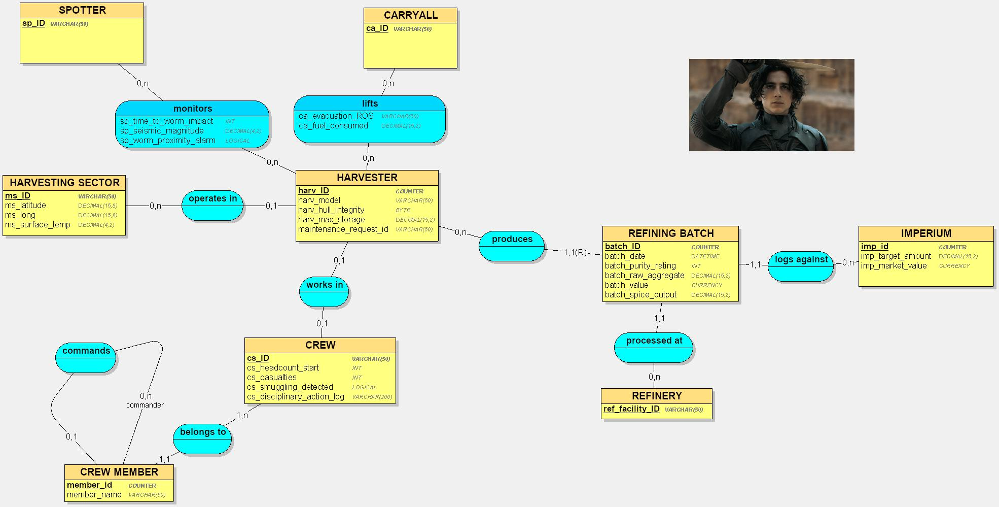

# Databases 1: Database Design and Development
**Authors:** Tom Hausmann & Taha Ezzahraoui  
**Domain:** Imperial Resource Extraction (Arrakis Planetary Governorship)  

## Introduction
This repository contains the database design for the Harkonnen logistics network on Arrakis, developed using the MERISE methodology. Part 1 of this project covers the requirements analysis and the Conceptual Data Model (MCD).

---

## Step 1: Requirements Analysis

### 1. Prompt Engineering
To generate the requirements and data dictionary, we utilized the RICARDO framework with the following prompt to an LLM:

> You work in the field of: Imperial Resource Extraction (Arrakis Planetary Governorship).Your organization is: House Harkonnen (Arrakis Division).It is involved in the domain of: Spice Melange Harvesting & Refining.It is an organization such as: A ruthless combination of a colonial military administration and a heavy industrial mining conglomerate (similar to a militarized OPEC or a hostile takeover of Halliburton).
>
> Data collected includes:
>
> Harvester fleet telemetry and hull integrity.
> Crew manifests and casualty reports.
> Sandworm seismic activity logs.
> Raw spice yields (in decagrams) vs. refined output.
> Carryall flight paths and fuel consumption.
> Imperial quotas and localized smuggling infractions.
> Take inspiration from: The Dune appendices by Frank Herbert (ecology/economy), industrial petroleum extraction logs, and fleet management systems.
>
> Your organization wants to apply MERISE to design an information system. You are responsible for the analysis part, i.e., gathering the company's requirements. It has called on a computer engineering student to carry out this project, and you must provide him with the necessary information so that he can then apply the following steps of database design and development himself.
> First, establish the data business rules for your organization in the form of a bulleted list. It must correspond to the information provided by someone who knows how the company works, but not how an information system is built.
> Next, based on these rules, provide a raw data dictionary with the following columns, grouped in a table: meaning of the data, type, size in number of characters or digits. There should be between 25 and 35 data items. It is used to provide additional information about each data item (size and type) but without any assumptions about how the data will be modeled later.
> Provide the business rules and the data dictionary.

### 2. Operational Business Rules
* **Fleet Deployment:** Our operation is divided into **Mining Sectors**. Each sector is identified by a grid code. A **Harvester** (our massive mobile factories) is deployed to a single sector at a time.
* **The Chain of Command:** Each Harvester is operated by a single **Crew**. We identify the crew by the **Commander's Name** and the **Shift ID**. We track the **Total Headcount** on board at start of shift and the **Casualty Count** at end of shift.
* **Aerial Support:** Every active Harvester must be monitored by a **Spotter** (Ornithopter). The Spotter reports **Seismic Activity** (Wormsign).
* **Evacuation Logistics:** When seismic tremors hit a certain threshold, a **Carryall** (heavy transport wing) is dispatched to lift the Harvester. We track the **Carryall’s ID** and its **Fuel Consumption** for the lift. If the Carryall is late, we lose the Harvester.
* **Production Metrics:** The Harvester sucks up sand. This is **Raw Aggregate**. It is measured by weight. This aggregate is processed at a **Refinery**.
* **Refining & Waste:** The Refinery separates the sand from the **Spice Melange**. We measure the **Refined Output** in decagrams. The difference between Raw Aggregate and Refined Output is waste—or theft. If the ratio drops below the standard, the crew is interrogated.
* **Imperial Obligations:** We are subject to a monthly **Imperial Quota**. Every gram of spice harvested must be logged against this quota.
* **Asset Management:** Harvesters take damage. We track **Hull Integrity** as a percentage. Below 40%, it is unsafe—but we often run them anyway.

### 3. Data Dictionary
| Meaning of Data (Signification) | Type | Size (Chars/Digits) |
| :--- | :--- | :--- |
| **Harvester Identification Code** | Alphanumeric | 10 |
| **Harvester Model / Class** | Alphanumeric | 20 |
| **Harvester Hull Integrity (%)** | Numeric | 3 |
| **Harvester Max Storage Capacity (kg)** | Numeric | 8 |
| **Mining Sector Grid ID** | Alphanumeric | 6 |
| **Sector Geo-Coordinates (Lat)** | Numeric | 12 |
| **Sector Geo-Coordinates (Long)** | Numeric | 12 |
| **Surface Temperature (Kelvin)** | Numeric | 3 |
| **Crew Shift ID** | Alphanumeric | 12 |
| **Commander Surname** | Alphanumeric | 30 |
| **Crew Headcount (Start)** | Numeric | 3 |
| **Crew Casualties (End)** | Numeric | 3 |
| **Spotter / Ornithopter ID** | Alphanumeric | 10 |
| **Seismic Tremor Magnitude (Richter-H)** | Numeric | 4 |
| **Worm Proximity Alarm (Boolean)** | Alphanumeric | 1 |
| **Time to Worm Impact (Seconds)** | Numeric | 4 |
| **Carryall Wing ID** | Alphanumeric | 10 |
| **Carryall Fuel Consumed (Liters)** | Numeric | 6 |
| **Evacuation Success Status** | Alphanumeric | 15 |
| **Raw Aggregate Yield (kg)** | Numeric | 10 |
| **Refinery Facility ID** | Alphanumeric | 8 |
| **Refining Date Timestamp** | Date/Time | 14 |
| **Refined Spice Output (Decagrams)** | Numeric | 12 |
| **Chemical Purity Rating (%)** | Numeric | 5 |
| **Imperial Quota ID** | Alphanumeric | 12 |
| **Quota Target Amount (Decagrams)** | Numeric | 15 |
| **Smuggling Infraction Detected (Y/N)** | Alphanumeric | 1 |
| **Market Value Per Decagram (Solaris)** | Numeric | 10 |
| **Total Batch Value (Solaris)** | Numeric | 15 |
| **Maintenance Request ID** | Alphanumeric | 12 |
| **Crew Disciplinary Action Log** | Alphanumeric | 200 |

---

## Step 2: Conceptual Data Model (MCD)

The MCD fully integrates the business rules and raw data dictionary into a normalized structure. 

**Advanced Modeling Elements Used:**
1. **Recursive Relationship:** Applied to the `CREW MEMBER` entity via the `commands` association (a commander commands 0 to n crew members).
2. **Weak Entity (Relative Identification):** Applied to the `REFINING BATCH` entity. A batch of spice is structurally dependent on the `HARVESTER` that produced it (`1,1(R)` cardinality).



---

## Step 3: Logical Data Model (MLD)

The following schema represents the translation of the Conceptual Data Model (MCD) into relational tables. Primary keys are the leading attributes, and foreign keys are denoted by `#`.

```text
HARVESTING_SECTOR = (ms_ID VARCHAR(50), ms_latitude DECIMAL(15,15), ms_long DECIMAL(15,15), ms_surface_temp VARCHAR(50));
CREW = (cs_ID VARCHAR(50), cs_headcount_start INT, cs_casualties VARCHAR(50), cs_smuggling_detected LOGICAL, cs_disciplinary_action_log VARCHAR(200));
SPOTTER = (sp_ID VARCHAR(50));
CARRYALL = (ca_ID VARCHAR(50));
REFINERY = (ref_facility_ID VARCHAR(50));
IMPERIUM = (imp_id COUNTER, imp_target_amount DECIMAL(15,2), imp_market_value CURRENCY);
CREW_MEMBER = (member_id COUNTER, member_name VARCHAR(50), #member_id_commander*, #cs_ID);
HARVESTER = (harv_ID COUNTER, harv_model VARCHAR(50), harv_hull_integrity BYTE, harv_max_storage DECIMAL(15,2), harv_maintenance_request_id VARCHAR(50), #cs_ID, #ms_ID*);
REFINING_BATCH = (#harv_ID, batch_id VARCHAR(50), batch_date DATETIME, batch_purity_rating VARCHAR(50), batch_raw_aggregate DECIMAL(15,2), batch_spice_output VARCHAR(50), batch_value CURRENCY, #imp_id, #ref_facility_ID);
lift = (#harv_ID, #ca_ID, ca_evacuation_ROS VARCHAR(50), ca_fuel_consumed DECIMAL(15,2));
monitors = (#harv_ID, #sp_ID, sp_seismic_magnitude VARCHAR(50), sp_worm_proximity_alarm LOGICAL, sp_time_to_worm_impact VARCHAR(50));
```
## Usage Scenario

The database has been developped exclusively for the Baron Vladimir Harkonnen, master of House Harkonnen and Siridar-Governor of Arrakis/Dune.

For the Baron, the planet is a machine. It must produce spice, only produced on this planet.

Lately, his man have been insubordinating...
Batches of spice have been of low quality...
Harvesters have been falling appart...


In one of the harvester malfunction, some crew members died. Sure, house harkonnen doesn't honnor its people. But here, two very important mans to the baron seems to have died. The baron needs to make sure who those two people were. (Note : one of them is the commander of the crew, while the other as the ID of the commander + 1)


## Extracted Data


On arrakis, there are smuggler that are using highly industrialized channel to sell spice on the black Market. The Baron needs to get the batch rating and batch value of the facilities containing, in their name, the word "Smuggler" or "Industrial". 

```sql
SELECT  
    batch_purity_rating, batch_value
FROM REFINING_BATCH
WHERE ref_facility_ID LIKE '%Smuggler%' 
   OR ref_facility_ID LIKE '%Industrial%';
```
This query uses : Projection, Selection, Masks

---

Harvester are falling appart. The baron needs to know the model and hull integrity of the harvester whose hull_integrity is between 60 and 80%.

```sql
SELECT harv_hull_integrity, harv_model
FROM HARVESTER
WHERE harv_hull_integrity BETWEEN 60 AND 80;
```

This query uses : Projection, Selection, BETWEEN

---

The Tuek family are known smugglers... We need to identify if there are such individuals in our crew with "Tuek" in their names. If there is, we want their full name, member id and crew id.

```sql
SELECT member_id, member_name, cs_id
FROM CREW_MEMBER 
WHERE member_name LIKE '%Tuek';
```
This query uses : LIKE (Masks), projection, Selection

---
The Baron needs to understand which sectors of his fief are dangerous... To do so, he'll cross-examine data from his spotter and harvester, to check in which 
sectors the seismic magnitude is either "High" or "Critical".

```sql
SELECT sp_id, ms_id, sp_seismic_magnitude
FROM monitors m
JOIN HARVESTER h
ON h.harv_ID = m.harv_ID
WHERE sp_seismic_magnitude IN ("High", "Critical")
ORDER BY sp_seismic_magnitude
;
```

This query uses : IN, sorting, SELECTION, Projection, Join

---

In one of the harvester malfunction (harv_maintenance_request_id = "REQ-URGENT"), some crew members died. Sure, house harkonnen doesn't honnor its people. But here, two very important man to the baron seem to have died. The baron needs to make sure who those two people were. (Note : one of them is the commander of the crew, while the other as the ID of the commander + 1)


```sql
SELECT member_name, cs_disciplinary_action_log
FROM CREW_MEMBER CM
JOIN HARVESTER H
ON CM.cs_id = H.cs_id
JOIN CREW C
ON CM.cs_ID = C.cs_id
WHERE H.harv_maintenance_request_id = "REQ-URGENT" 
AND member_id - 1 = member_id_commander OR member_id = 13;
;

```

This query uses : Selection, Projection, Multiple Join

---

We need to check if we meet the imperial quotas. To do so, the baron will need to cross examine the imperial table with the refining_batch table ! Moreoever, we need to understand who is the commander of the crew that harvested this specific batch, to punish him if he didn't meet quotas...

```sql
SELECT 
    b.batch_id, 
    b.batch_value, 
    i.imp_target_amount,
    cm.member_name AS commander_name
FROM REFINING_BATCH b 
INNER JOIN IMPERIUM i ON b.imp_id = i.imp_id
INNER JOIN HARVESTER h ON b.harv_ID = h.harv_ID
INNER JOIN CREW_MEMBER cm ON h.cs_ID = cm.cs_ID
WHERE cm.member_id_commander IS NULL;
```
This query use : inner join, projection, selection

---
 -- Aggregation Functions
 
We need to know which refinery is the WORST of all. To do that, the baron must add all the spice output and total raw aggregate grouped by refinery(two seperate fields) and create an efficiency percentage (total spice output/total raw aggregate)x*100* . Then, he must order by descending order to get the worst refinery.

```sql
SELECT 
    ref_facility_ID,
    SUM(batch_spice_output) AS total_yield,
    SUM(batch_raw_aggregate) AS total_raw_material,
    (SUM(batch_spice_output) / SUM(batch_raw_aggregate)) * 100 AS efficiency_percentage
FROM REFINING_BATCH
GROUP BY ref_facility_ID
ORDER BY efficiency_percentage ASC
LIMIT 1;
```
 
An Imperial Operations Auditor has been sent to Arrakis to evaluate the efficiency of House Harkonnen's spicevextraction chain.


The auditor needs to know which harvester contributes the most to the spice flow,so he orders the harvesters from most to least spice output.

```sql
SELECT harv_ID,
       SUM(CAST(batch_spice_output AS DECIMAL(15,2))) AS total_spice_output
FROM REFINING_BATCH
GROUP BY harv_ID
ORDER BY total_spice_output DESC;
```

The auditor suspects theft or inefficient refining in facilities where the gap between raw aggregate and spice output is too large.

```sql
SELECT ref_facility_ID,
       AVG(batch_raw_aggregate - CAST(batch_spice_output AS DECIMAL(15,2))) AS avg_waste
FROM REFINING_BATCH
GROUP BY ref_facility_ID
HAVING AVG(batch_raw_aggregate - CAST(batch_spice_output AS DECIMAL(15,2))) > 500
ORDER BY avg_waste DESC;
```

Aerial rescue logistics can get quite expensive. In order to cut costs,he highlights the least efficient carryalls.

```sql
SELECT ca_ID,
       AVG(ca_fuel_consumed) AS avg_fuel_consumption
FROM lift
GROUP BY ca_ID
HAVING AVG(ca_fuel_consumed) > 550
ORDER BY avg_fuel_consumption DESC;
```

The auditor wants his "king harvester", the one that generates the highest wealth,so he can closely monitor and protect it.

```sql
SELECT harv_ID,
       SUM(batch_value) AS total_batch_value
FROM REFINING_BATCH
GROUP BY harv_ID
HAVING SUM(batch_value) > 700000
ORDER BY total_batch_value DESC;
```

The auditor wants to reveal whether certain harvesters are being pushed beyond safe limits while still remaining in service.

```sql
SELECT harv_model,
       ROUND(AVG(harv_hull_integrity), 2) AS avg_hull_integrity,
       COUNT(*) AS deployed_units
FROM HARVESTER
GROUP BY harv_model
HAVING AVG(harv_hull_integrity) < 85
ORDER BY avg_hull_integrity ASC;
```
